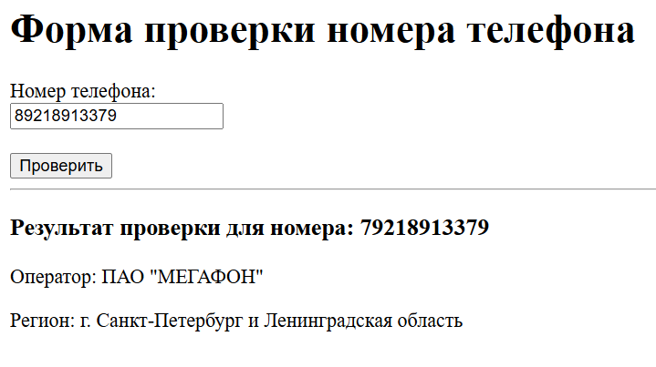

# Operator by phone



### Для локального старта

```shell
git clone https://github.com/Artasov/operator-by-phone
cd ./operator-by-phone
# Переименуем файл .env.example в .env
mv .env.example .env
docker-compose --env-file .env -f docker-compose.yml up --build

```

### На убунте то же самое просто поменять в `.env` и `nginx` запустить рядом 

### Чтобы затестить локально
* Superuser уже есть `123:123` / `Логин:Пароль`
* Чтобы не ждать пока номера сами обновятся через запланированные задачи, 
  нужно в админке выполнить ежедневную таску [daily-update-phone-data](http://localhost:8000/admin/django_celery_beat/periodictask/).
  <br>Выбираем `daily-update-phone-data`, в Action выбираем `Run select task`
  нажимаем `Go`
* Какое-то время файлы будут скачиваться и парситься, в консоли будут логи.
* После в разделе [PhoneRanges в админке](http://localhost:8000/admin/operator_by_phone/phonerange/)
  появятся строки из csv.
* Перейдя на [страницу формы для проверки номера](http://localhost:8000/operator_by_phone/, 
  вы сможете проверить функционал.
### Тестировать на адресе http://localhost:8000/operator_by_phone/